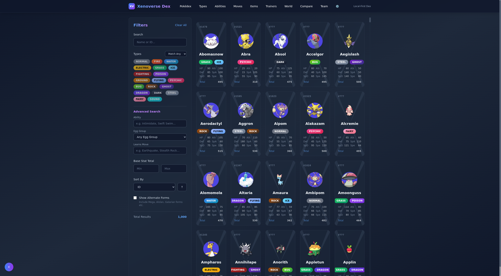
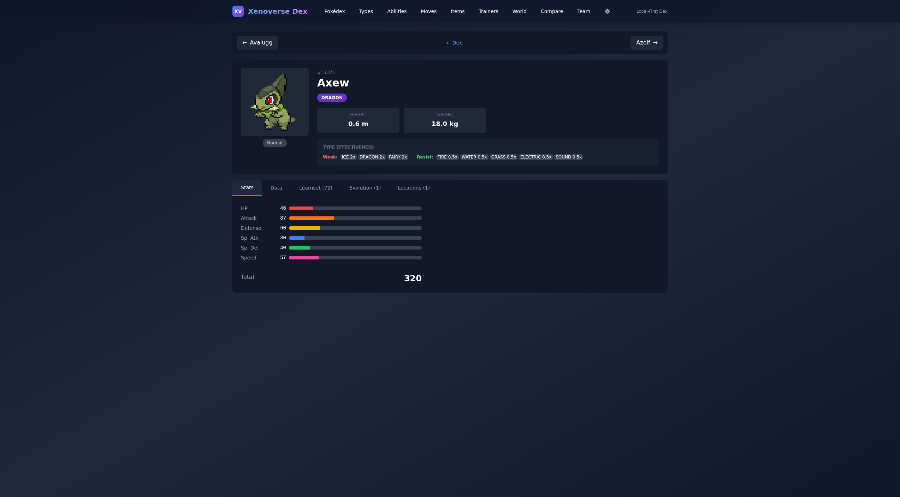
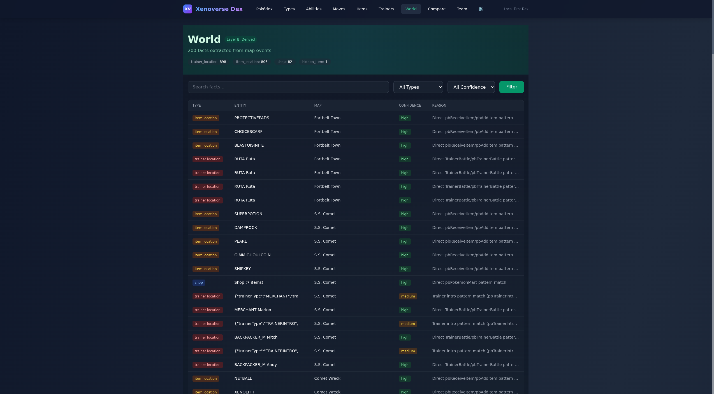

# Xenoverse Dex

A modern, high-performance Pokédex application for Pokémon Xenoverse and official Pokémon games. Built with Next.js, Tailwind CSS, and SQLite.



## Features

- **Comprehensive Search**: Fast, client-side search across all Pokémon.
- **Detailed Stats**: View stats, types, abilities, moves, and evolution chains.
- **Interactive World Map**: Explore the Xenoverse region map.
- **Compare Mode**: Compare stats and details of multiple Pokémon side-by-side.
- **Responsive Design**: Optimized for desktop and mobile.



## Prerequisites

- Node.js v18 or higher
- npm or pnpm

## Installation

1. Clone the repository:
   ```bash
   git clone https://github.com/YOUR_USERNAME/xenoverse-dex.git
   cd xenoverse-dex/apps/dex
   ```

2. Install dependencies:
   ```bash
   npm install
   ```

## Running Locally

1. Start the development server:
   ```bash
   npm run dev
   ```

2. Open [http://localhost:3000](http://localhost:3000) (or port 3001 if specified) in your browser.

## Project Structure

- `apps/dex`: Main Next.js application.
- `tools`: Utility scripts (image audit, DB management).
- `Graphics`: Asset directory for sprites and icons.



## License

MIT
